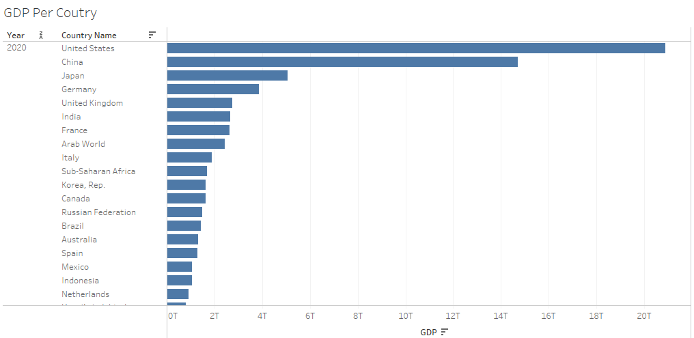

# Tableau
Tableau Visualizations
We will use Tableau 2021.4 to make several charts about the world and per country GDP. For this reason, we combine two datasets that are included in the Data file. The "GDP_PER_COUNTRY.xlsx," which you can find at the following link: https://data.worldbank.org/indicator/NY.GDP.MKTP.CD?locations=PE, consists of the GDP per country and its evolution in years from 1960 to 2020. Furthermore, we use the dataset "DataGeographies_v1_byGapminder.xlsx," which you can find at the following link: https://www.gapminder.org/data/, to take the geolocation of each country (i.e., Latitude and Longitude fields).

Let's jump into it. The first chart is about the total world GDP evolution from 1960 to 2020.

WORLD TOATL GDP

The second chart is about each country's GDP for the year 2020.

Tableau also provides the functionality to create animated charts. The following image is a screenshot from an animate bar chart that shows the evolution of the GDP per year for each country in descending order.

